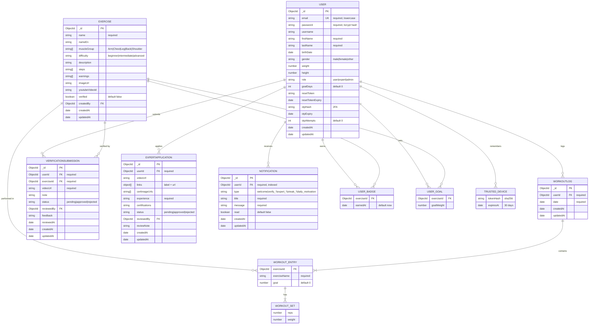

# YOKLEK — Database ER Diagram

ฐานข้อมูล MongoDB (Mongoose) — 6 collections

## หมายเหตุโครงสร้าง

- **Embedded (ฝังในเอกสาร ไม่ใช่ collection แยก):**
  - `TRUSTED_DEVICE`, `USER_BADGE`, `USER_GOAL` → ฝังเป็น array ใน **USER**
  - `WORKOUT_ENTRY` → ฝังเป็น array `exercises[]` ใน **WORKOUTLOG**
  - `WORKOUT_SET` → ฝังเป็น array `sets[]` ใน WORKOUT_ENTRY (ซ้อน 2 ชั้น)

- **Collections จริงใน MongoDB มี 6 ตัว:** users, exercises, workoutlogs, verificationsubmissions, expertapplications, notifications

- **Reference (FK ข้าม collection):** `userId`, `exerciseId`, `reviewedBy`, `createdBy` เก็บเป็น ObjectId ใช้ `.populate()` ตอน query

- **Indexes:**
  - `User.email` (unique)
  - `Exercise` text index บน name/nameEn/description
  - `WorkoutLog` { userId, date desc }
  - `Notification.userId`
